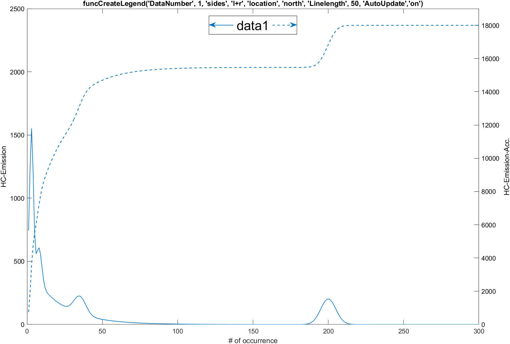

# CreateLegend

[]  
[]

**funcCreateLegend.m** — Custom combined legend for dual-`yyaxis` plots in MATLAB:
<div align="center">
    
</div>


## Table of Contents

1. [Overview](#overview)  
2. [Installation](#installation)  
3. [Usage](#usage)  
4. [Parameters](#parameters)  
5. [Examples](#examples)  
6. [Additional](#additional)


## Overview

`funcCreateLegend` adds a single legend box to MATLAB figures using two y-axes, with clear left/right indicators (and optional arrows). It can also **auto-reflow** on window resize (`'AutoUpdate','on'`). Ideal when you plot:

- Left axis: time-series measurement  
- Right axis: cumulative or secondary value  

Default MATLAB `legend` cannot visually tie items to separate y-axes—this function does.


## Installation

1. **Clone** or download this repo.  
2. **Add** it to your MATLAB path:

   ```matlab
   addpath(fullfile(pwd, 'CreateLegend'));
3. **(Optional) save path** savepath;


## Usage
% 1) Plot your data with yyaxis
x = 1:100;
yyaxis left
plot(x, sin(x), '-o');
yyaxis right
plot(x, cumsum(sin(x)), '--*');

% 2) Call funcCreateLegend with options
funcCreateLegend( ...
    "DataNumber", 2,      ... % number of plotted lines
    "sides", "l+r",       ... % show both left and right indicators
    "location", "north",  ...
    "Linelength", 40,     ...
    "Arrows", "on",       ...
    "Text", ["Signal","Cumulative"], ...
    "Absoffset", [0,50]   ...
);

## Parameters
| Parameter     | Type              | Default                        | Description |
|---------------|-------------------|--------------------------------|-------------|
| `Text`        | `string[]`        | `{"data1","data2",...}`        | Labels shown in the legend. Whitespaces are replaced with underscores. |
| `DataNumber`  | `numeric`         | auto-detected                  | Number of plotted datasets to include in the legend. |
| `sides`       | `string`          | `"l"`                          | Which axis side(s) to show: `"l"`, `"r"`, `"l+r"` (or `"r+l"`). |
| `location`    | `string`          | `"northeast"`                  | Legend placement: `"north"`, `"south"`, `"eastoutside"`, `"northwest"`, etc. |
| `Fontname`    | `string`          | `"Arial"`                      | Font used for the legend text. |
| `Fontsize`    | `numeric`         | `20`                           | Font size in points (>0). |
| `Arrows`      | `string`          | `"off"` (auto `"on"` if `l+r`) | Show arrows pointing toward the axis (`"on"`/`"off"`). |
| `Linelength`  | `numeric`         | `26`                           | Length of indicator line segments (px). |
| `Linewidth`   | `numeric`         | `1`                            | Width of indicator line segments/arrows. |
| `Absoffset`   | `[x,y]` (pixels)  | `[15, 15]`                     | Absolute pixel offset of legend from anchor. |
| `Percoffset`  | `[x,y]` (%)       | `[2, 2]`                       | Offset as % of axes width/height. Not allowed together with `Absoffset`. |
| `Linestyle`   | `string[2]`       | `["-","--"]`                   | Override indicator line styles for left and right axes. |
| `Colors`      | `cell{[r g b]}`   | MATLAB default line colors     | Colors for each dataset, values between 0 and 1. |
| `AutoUpdate`  | `"on"|"off"`      | `"off"`                        | If `"on"`, the legend automatically repositions (and can rescale) when the figure is resized. |
| `ScaleAbsOffset` | `"on"|"off"`   | `"off"`                        | When using `Absoffset`, scale the pixel offset with the figure size during `AutoUpdate`. |

## Examples
The script `make_hc_emission_plot.m` demonstrates five configurations and saves PNGs in resources/:
- Example 1: Default
- Example 2: Both Sides
- Example 3: North + Linelength 50
- Example 4: Custom Text + Offset
- Example 5: Linestyle Override

## Additional
Please feel free to use this functions and if you have an improvement then either create a pull request or let me know about it.
I hope this helps someone.
